# 一、项目介绍

## **1.1、项目介绍**

考试宝是一款基于 Next.js + Spring Boot + Redis + MySQL + Elasticsearch 的 **在线刷题平台**，运用 Druid + HotKey + Sa-Token + Sentinel 提高了系统的性能和安全性。

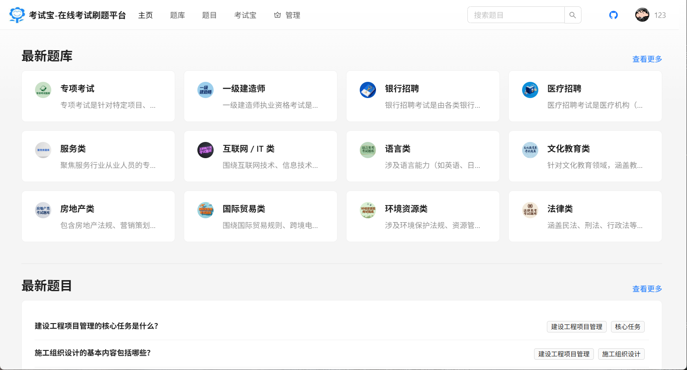

管理员可以创建题库、题目和题解；用户可以注册登录、分词检索题目、在线刷题并查看刷题记录日历图。此外，系统使用数据库连接池、热 Key 探测、缓存、高级数据结构等来提升性能。通过流量控制、熔断、动态 IP 黑白名单过滤、同端登录冲突检测、分级反爬虫策略来提升系统和内容的安全性。

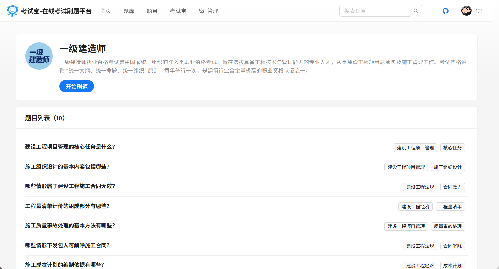

## 1.2、技术栈

**前端：**

- `React 18`
- `Next.js 14` 服务端渲染框架
- `pnpm` 包管理工具
- `ES Module` 模块化规范
- `sass` CSS预处理器
- `Ant Design 5.x` 组件库
- `ProComponents` 组件库
- `Redux Toolkit` 状态管理
- `TypeScript 5` 类型控制
- `Eslint` 代码规范控制
- `Prettier` 美化代码
- `Axios` 网络请求
- `OpenAPI`接口代码生成
- `ECharts`数据可视化

**后端:**

- `Java Spring Boot` 框架 + `Maven` 多模块构建

- `MySQL` 数据库 + `MyBatis-Plus` 框架 + `MyBatis X`

- `Redis` 分布式缓存 + `Caffeine` 本地缓存

- `Redission` 分布式锁 + `BitMap` + `BloomFilter`

- `Elasticsearch` 搜索引擎

- `Druid` 数据库连接池 + 并发编程

- `Sa-Token` 权限控制

- `Sentinel` 流量控制

- `Nacos` 配置中心

  

## 1.3、项目功能梳理

1. **高效开发体系**

- 基于MyBatis X插件 + 自定义代码生成器实现基础业务代码自动生成
- 通过Spring Data Elasticsearch QueryBuilder构建动态搜索条件

2. **刷题统计引擎**

- 采用Redis BitMap存储每日刷题状态（1位/天）
- 结合Redisson实现分布式位操作
- 通过位运算 + 本地缓存优化统计接口性能

3. **智能搜索系统**

- 基于ES构建分词索引（ik分词器）
- 动静分离策略：ES存储静态元数据 + MySQL动态关联查询
- 使用Kibana DevTools进行DSL调试
- Spring Scheduler定时增量同步机制

4. **性能优化体系**

- Caffeine本地缓存 + Hotkey热键探测
- MyBatis批处理 + CompletableFuture并行化
- Druid连接池监控与慢SQL优化
- Redis Lua脚本保证原子操作

5. **系统保护机制**

- Sentinel热点参数限流（QPS/异常熔断）
- 分级反爬策略：BloomFilter黑名单 + 访问频率控制
- Sa-Token同端登录冲突检测
- UserAgent设备指纹识别

6. **安全防护层**

- WebFilter实现IP黑名单拦截
- Nacos动态规则更新
- 分级反爬告警系统（自动封禁+管理通知）

7. **接口生态**

- Knife4j+Swagger自动化文档
- 标准化API注解体系

## 1.4、页面展示

主页：

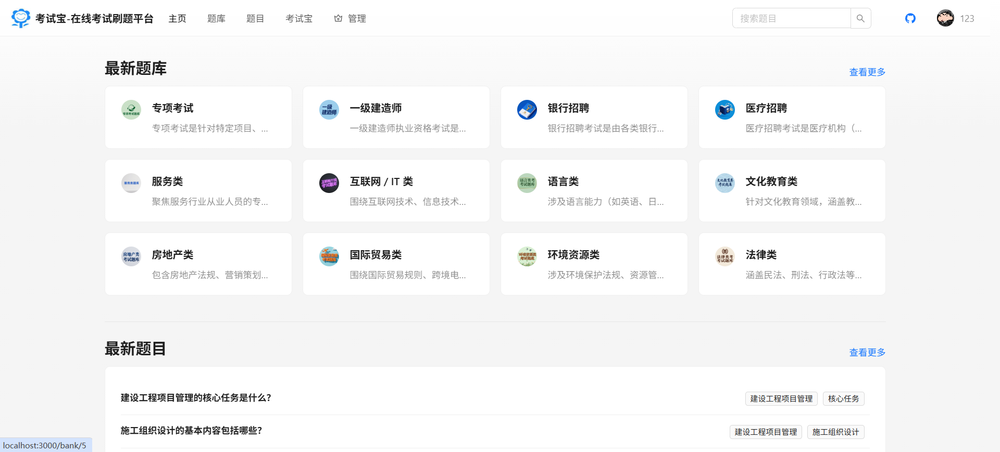

题库页：

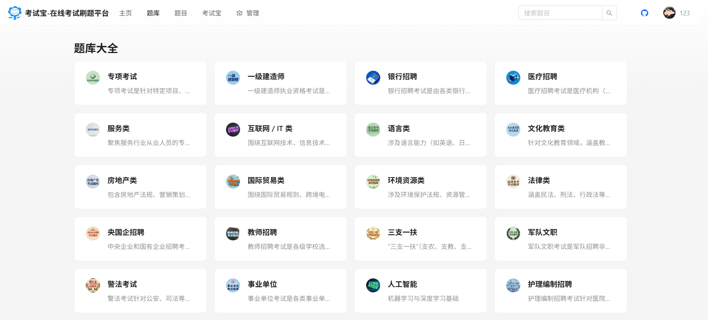

题库详情：

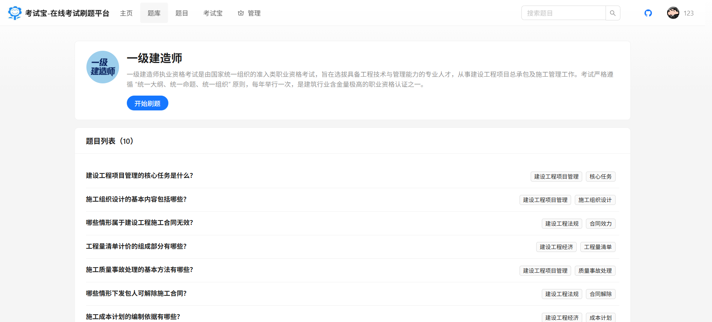

题目页：

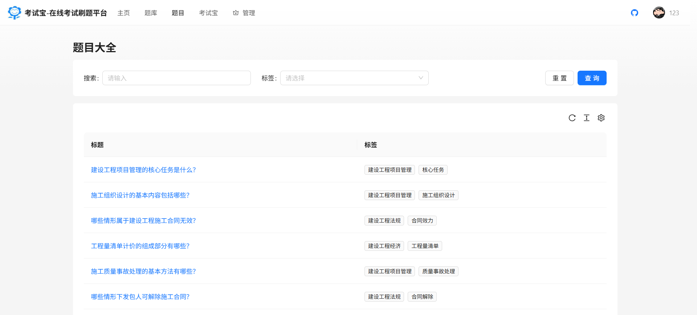

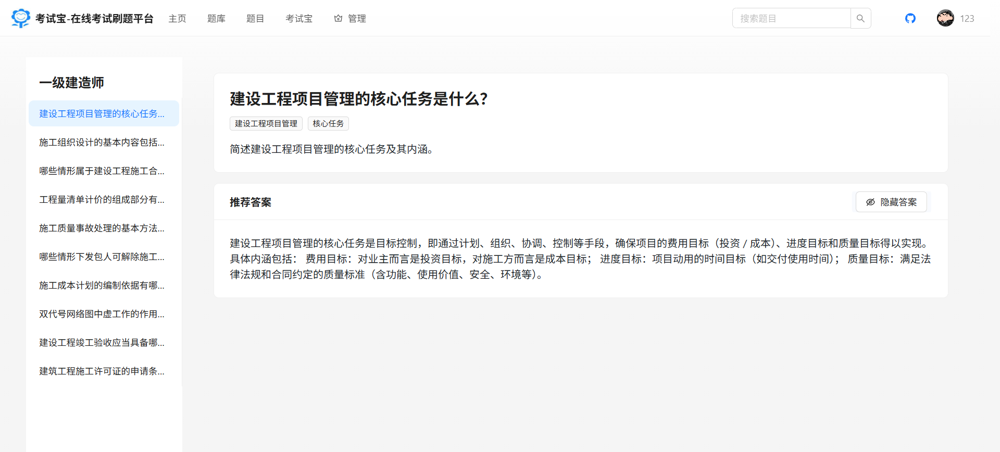

登录页：

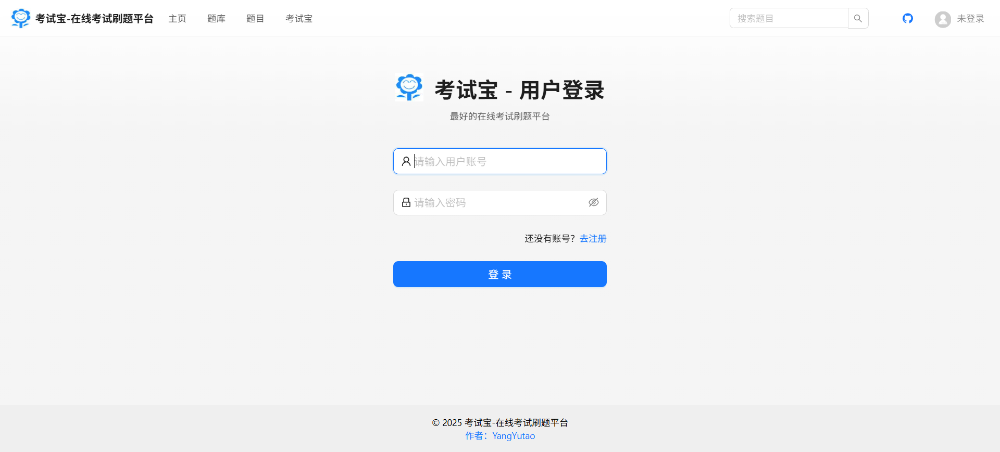

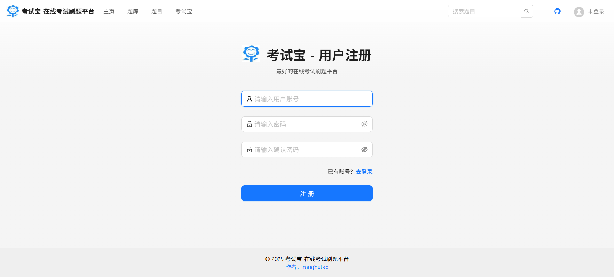

个人中心：

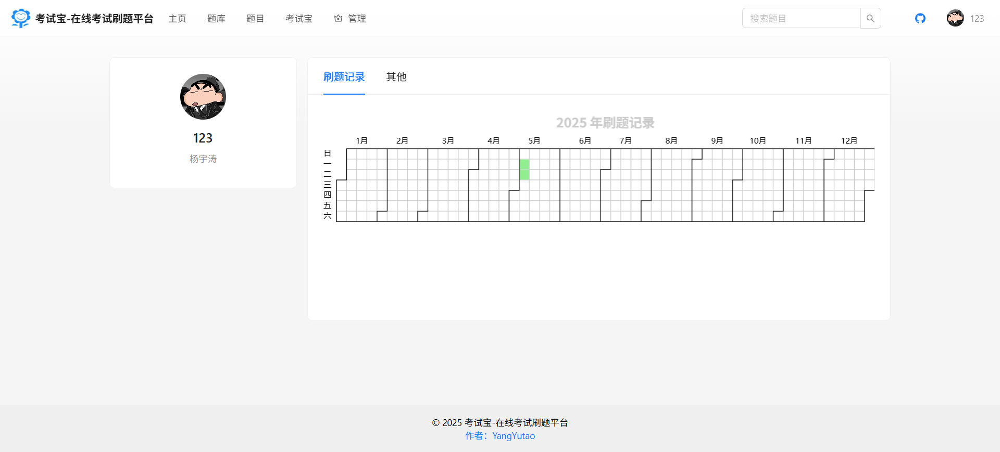

用户管理：

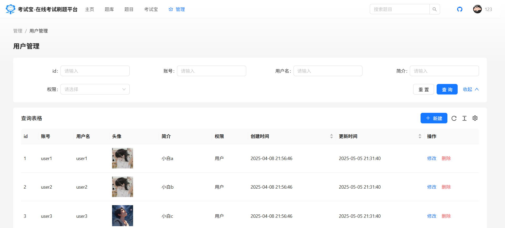

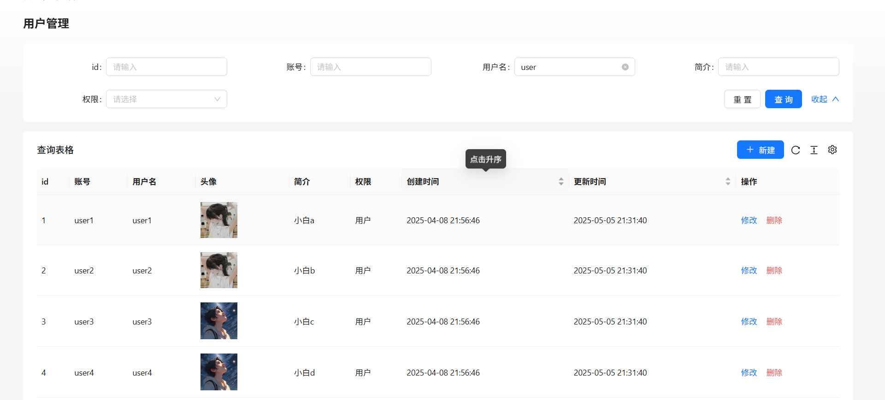

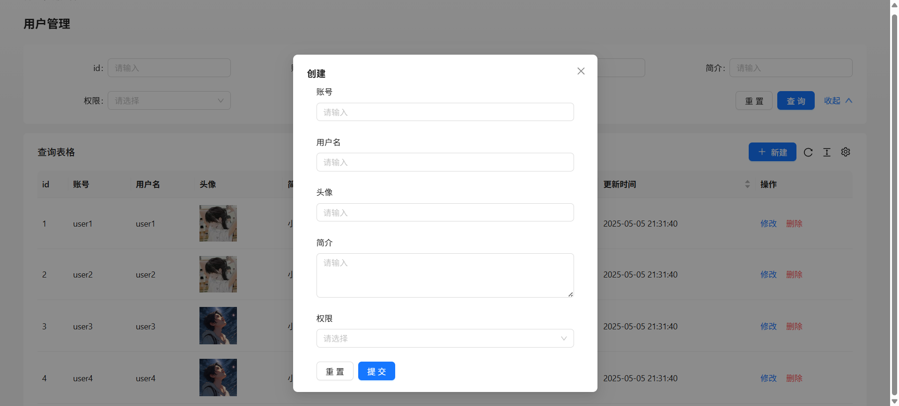

题库管理：

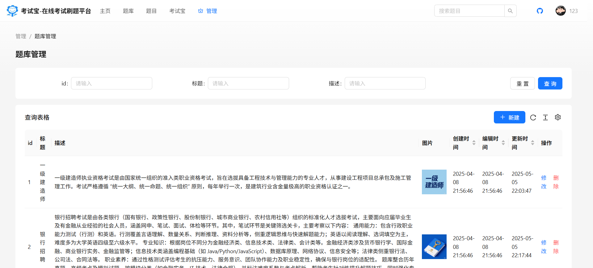

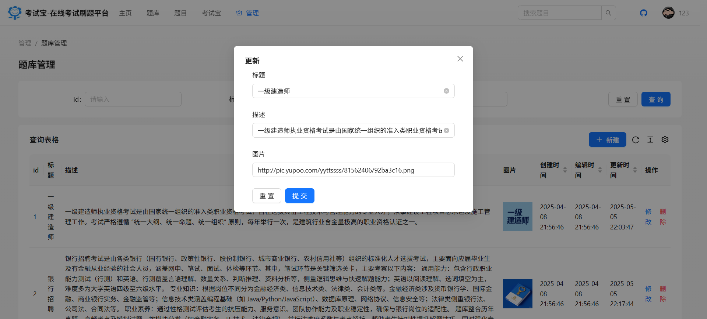

题目管理：

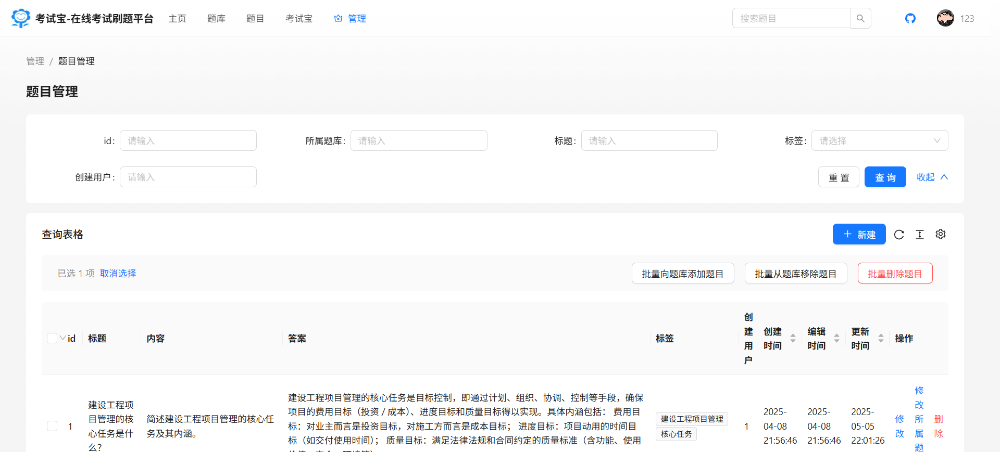

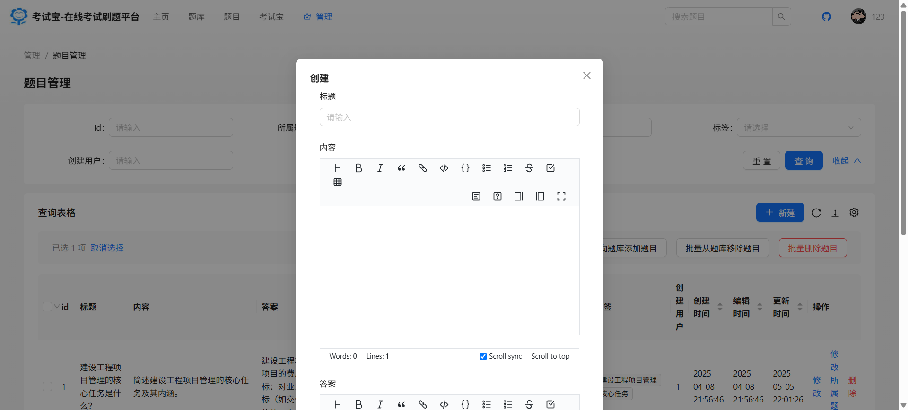

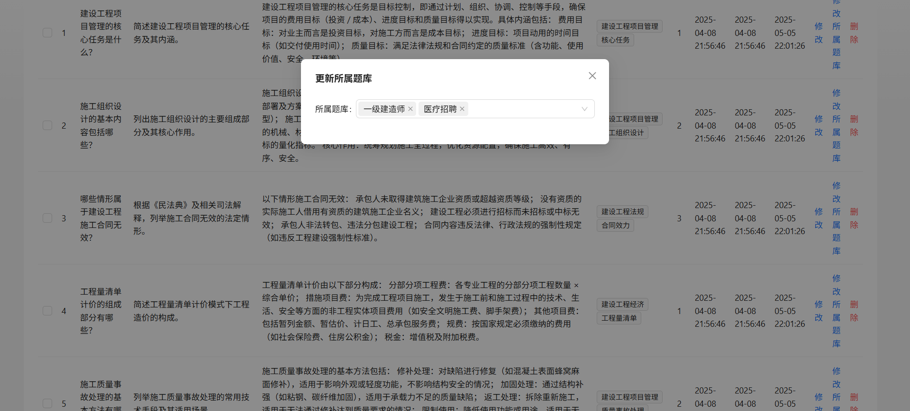

