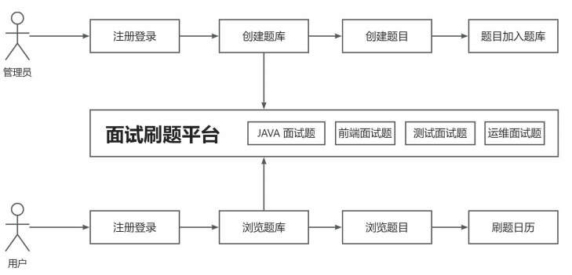
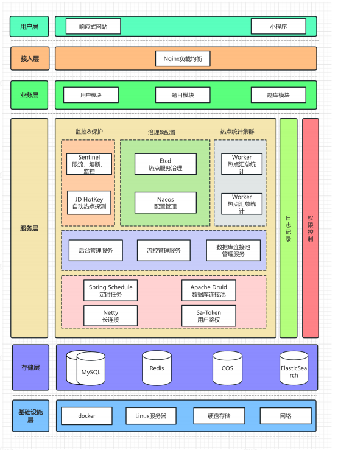

# 一、项目介绍

## **1.1、项目介绍**

考试宝是一款基于 Next.js + Spring Boot + Redis + MySQL + Elasticsearch 的 **在线刷题平台**，运用 Druid + HotKey + Sa-Token + Sentinel 提高了系统的性能和安全性。

管理员可以创建题库、题目和题解；用户可以注册登录、分词检索题目、在线刷题并查看刷题记录日历图。此外，系统使用数据库连接池、热 Key 探测、缓存、高级数据结构等来提升性能。通过流量控制、熔断、动态 IP 黑白名单过滤、同端登录冲突检测、分级反爬虫策略来提升系统和内容的安全性。

## **1.2、核心业务流程**

## 1.3、项目功能梳理

**基础功能：**（均为p0）

- 用户模块
  - 用户注册
  - 用户登录（账号密码）
  - 【管理员】管理用户 - 增删改查
- 题库模块
  - 查看题库列表
  - 查看题库详情（展示题库下的题目）
  - 【管理员】管理题库 - 增删改查

- 题目模块
  - 题目搜索
  - 查看题目详情（进入刷题页面）
  - 【管理员】管理题目 - 增删改查（比如按照题库查询题目、修改题目所属题库等）

**高级功能：**

- 题目批量管理  p1
  - 【管理员】批量向题库添加题目
  - 【管理员】批量从题库移除题目
  - 【管理员】批量删除题目

- 分词题目搜索 p1
- 用户刷题记录日历图 p1
- 自动缓存热门题目 p2
- 网站流量控制和熔断 p2
- 动态 IP 黑白名单过滤 p2
- 同端登录冲突检测 p2
- 分级题目反爬虫策略 p2

## 1.4、**技术选型**

**前端：**

- React 18 框架
- ⭐ Next.js 服务端渲染
- ⭐ Redux 状态管理
- Ant Design 组件库
- 富文本编辑器组件
- ⭐ 前端工程化：ESLint + Prettier + TypeScript
- ⭐ OpenAPI 前端代码生成

**后端:**

- Java Spring Boot 框架 + Maven 多模块构建
- MySQL 数据库 + MyBatis-Plus 框架 + MyBatis X
- Redis 分布式缓存 + Caffeine 本地缓存
- Redission 分布式锁 + BitMap + BloomFilter
- ⭐ Elasticsearch 搜索引擎
- ⭐ Druid 数据库连接池 + 并发编程
- ⭐ Sa-Token 权限控制
- ⭐ HotKey 热点探测
- ⭐ Sentinel 流量控制
- ⭐ Nacos 配置中心
- ⭐ 多角度项目优化：性能、安全性、可用性

## 1.4、**架构设计**

